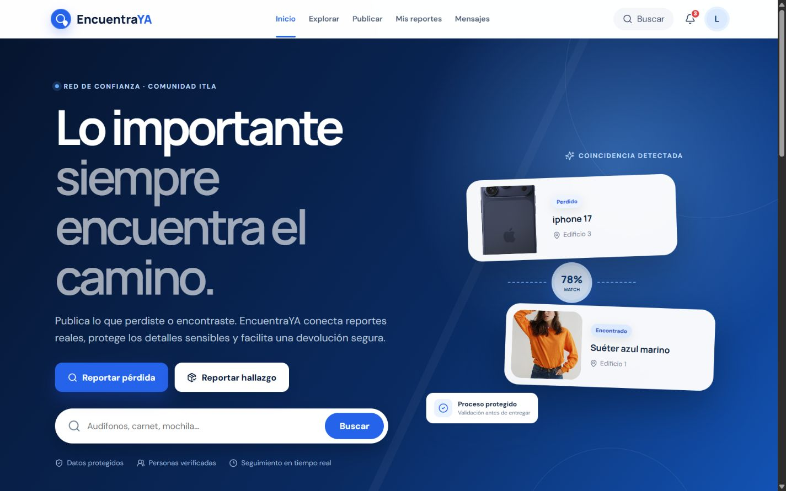

# EncuentraYA

Plataforma full stack para registrar, relacionar y devolver objetos perdidos dentro de una comunidad educativa. Incluye autenticación, publicaciones con fotografías, coincidencias, reclamaciones privadas, notificaciones, mensajería persistente y administración.




## El problema

Los objetos perdidos suelen gestionarse mediante chats dispersos, publicaciones sin seguimiento y entregas difíciles de validar. EncuentraYA concentra el proceso completo y mantiene trazabilidad desde el reporte hasta la devolución.

## Funcionalidades

- Registro e inicio de sesión con JWT, PBKDF2 y autorización por roles.
- Publicaciones de objetos perdidos o encontrados con fotografías.
- Búsqueda y filtros por tipo, categoría, estado y ubicación.
- Motor de coincidencias por categoría, palabras, ubicación y fecha.
- Reclamaciones con información privada de verificación.
- Mensajería y notificaciones persistentes vinculadas a cada caso.
- Historial personal y panel administrativo.
- Diseño responsive, accesible y orientado a dispositivos móviles.

## Arquitectura

El backend sigue **Clean Architecture** y el frontend una organización **feature-based**. Las dependencias apuntan hacia el dominio y los detalles externos permanecen en Infrastructure.

```text
backend/
├── EncuentraYA.Domain/
│   └── Model/                 # Entidades y enumeraciones del negocio
├── EncuentraYA.Application/
│   └── UseCases/              # Contratos, DTO e interfaces de aplicación
├── EncuentraYA.Infrastructure/
│   ├── Persistence/           # EF Core, PostgreSQL, migraciones y datos iniciales
│   └── Services/              # Imágenes, hashing y motor de coincidencias
└── EncuentraYA.API/
    ├── Bootstrap/             # JWT, middleware y composición HTTP
    └── Endpoints/             # Adaptadores de entrada REST

frontend/src/
├── app/                       # Composición, rutas y providers
├── features/                  # Flujos funcionales de EncuentraYA
└── shared/
    ├── api/                   # Cliente HTTP
    ├── config/                # Catálogo y configuración de dominio visual
    ├── hooks/                 # Infraestructura React reutilizable
    ├── styles/                # Sistema visual
    └── ui/                    # Componentes compartidos
```

Consulta [docs/ARCHITECTURE.md](docs/ARCHITECTURE.md) para decisiones, límites y flujo de datos.

## Tecnologías

| Área | Tecnologías |
|---|---|
| Frontend | React 19, Vite, React Router, Axios, Lucide, CSS moderno |
| Backend | C# 14, ASP.NET Core 10, Entity Framework Core 10 |
| Datos | PostgreSQL 17, migraciones EF Core |
| Seguridad | JWT, PBKDF2-SHA256, autorización por recursos y roles |
| Entorno | Docker Compose, Visual Studio, Swagger/OpenAPI |

## Ejecución local

### Requisitos

- Visual Studio 2026 con ASP.NET y Node.js, o .NET SDK 10 + Node.js 22.
- Docker Desktop.

### Visual Studio

1. Ejecuta `docker compose up -d postgres`.
2. Abre `EncuentraYA.slnx`.
3. Selecciona el perfil **EncuentraYA completo**.
4. Presiona **F5**.
5. Abre `http://localhost:5173/frontend/`.

La API queda disponible en `http://localhost:5080` y Swagger en `http://localhost:5080/swagger`.

### Terminal

```powershell
docker compose up -d postgres
dotnet run --project backend/EncuentraYA.API --urls http://localhost:5080
```

En una segunda terminal:

```powershell
cd frontend
npm install
npm run dev
```

## Usuarios de demostración

| Rol | Correo | Contraseña |
|---|---|---|
| Administrador | `admin@encuentraya.local` | `Admin123!` |
| Usuario | `user@encuentraya.local` | `Usuario123!` |

Estas cuentas son exclusivamente para desarrollo. Cambia la clave JWT y elimina los usuarios de demostración antes de un despliegue real.

## Verificación

```powershell
dotnet build EncuentraYA.slnx
cd frontend
npm run build
```

## Documentación

- [Arquitectura y decisiones técnicas](docs/ARCHITECTURE.md)
- [Referencia de API](docs/API.md)
- [Guía de contribución](CONTRIBUTING.md)
- [Política de seguridad](SECURITY.md)

## Licencia

Distribuido bajo la licencia MIT. Consulta [LICENSE](LICENSE).
