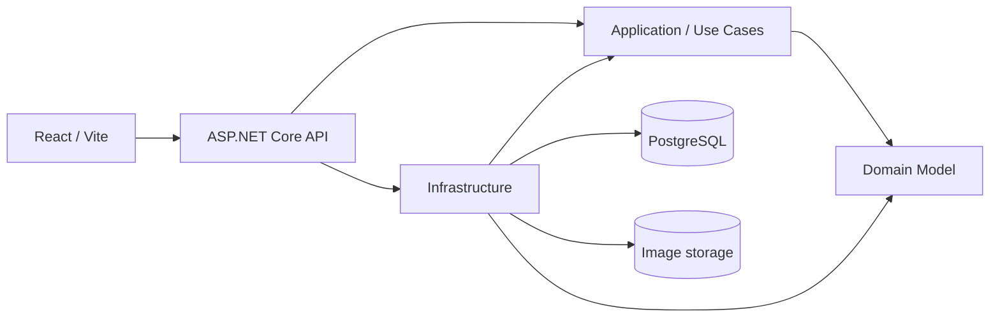
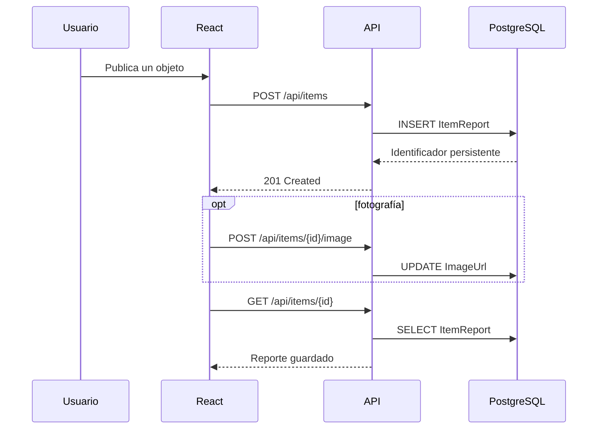

# Arquitectura de EncuentraYA

## Enfoque

EncuentraYA utiliza un monolito modular con Clean Architecture. La solución mantiene un despliegue simple sin mezclar reglas de negocio con HTTP, almacenamiento o presentación.

## Reglas de dependencia

1. **Domain** no depende de frameworks ni de otras capas.
2. **Application** depende de Domain y publica los contratos que requiere.
3. **Infrastructure** implementa persistencia y servicios externos definidos por Application.
4. **API** compone el sistema y adapta HTTP a casos de uso.
5. **Frontend** se organiza por funcionalidades; `shared` no conoce páginas concretas.

## Backend

### Domain

Contiene `User`, `ItemReport`, `Claim`, `ItemMatch`, `Conversation`, `Message` y `Notification`, además de sus estados. Representa el lenguaje del negocio y permanece independiente de EF Core.

### Application

Define DTO, solicitudes, respuestas y puertos como `IPasswordService`, `ITokenService`, `IImageStorageService` e `IMatchingService`. Evita que la API quede acoplada a implementaciones concretas.

### Infrastructure

- `Persistence/`: contexto EF Core, configuración relacional, migraciones y datos iniciales.
- `Services/`: hashing, almacenamiento seguro de imágenes y cálculo de coincidencias.

Las imágenes reciben nombres generados por el servidor y su extensión se deriva del MIME permitido, no del nombre enviado por el cliente.

### API

- `Bootstrap/`: JWT, manejo global de errores y utilidades del pipeline.
- `Endpoints/`: controladores REST y autorización por propietario o rol.

## Frontend

- `app/`: raíz de la aplicación, rutas y providers globales.
- `features/`: pantallas y flujos del producto.
- `shared/api`: cliente Axios, token y normalización de URLs.
- `shared/config`: categorías, nombres, fechas e imágenes de respaldo.
- `shared/hooks`: carga asíncrona reutilizable.
- `shared/ui`: navegación, tarjetas, estados y formularios.
- `shared/styles`: tokens y sistema visual responsive.

## Persistencia

PostgreSQL es la fuente de verdad. El navegador conserva solamente el token y una copia mínima de la sesión; publicaciones, reclamos, conversaciones, mensajes y notificaciones se consultan siempre desde la API.

## Seguridad

- Contraseñas con PBKDF2-SHA256, salt aleatorio y comparación en tiempo constante.
- JWT de duración limitada.
- Autorización en servidor para operaciones privadas.
- DTO públicos excluyen hash de contraseña y detalles privados.
- Imágenes limitadas a 5 MB y tipos JPEG, PNG o WebP.
- Conversaciones accesibles únicamente por sus participantes.

## Decisiones y evolución

El almacenamiento local de imágenes implementa una abstracción de Application. En producción puede sustituirse por S3, Cloudinary o Azure Blob sin cambiar Domain ni los endpoints consumidores. El monolito modular puede separar funcionalidades en servicios únicamente cuando el volumen o los límites operativos lo justifiquen.
